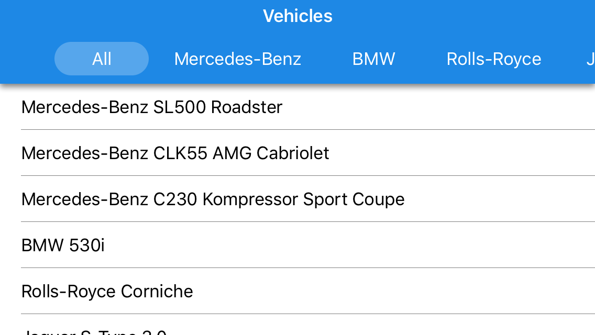

<!-- default badges list -->

<!-- default badges end -->
# Xamarin.Forms Navigation Views: Getting Started Lesson 2

This repository stores the application from the [Xamarin Forms Navigation Views Lesson 2: Populate Tab Items from an Items Source](https://docs.devexpress.com/MobileControls/400555/xamarin-forms/navigation-controls/getting-started/how-to-bind-to-itemssource) lesson. This lesson explains how to create a tab bar that allows users to filter a list of data items. The [TabView](https://docs.devexpress.com/MobileControls/DevExpress.XamarinForms.Navigation.TabView) is used to generate tab items from a data source to build the filtering tab bar.

